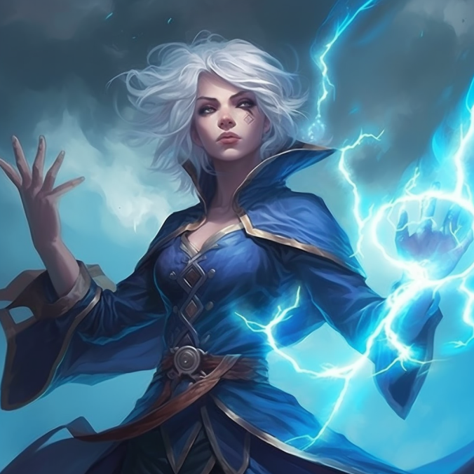
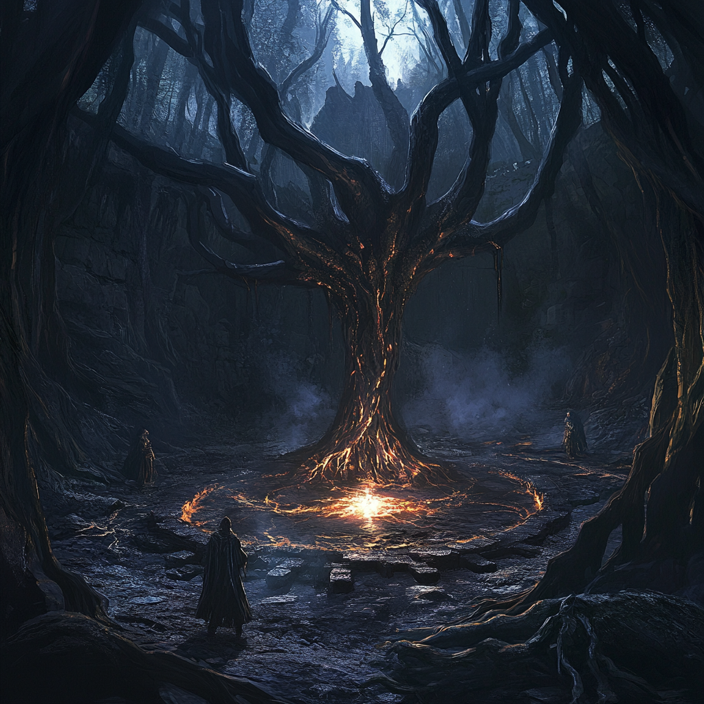
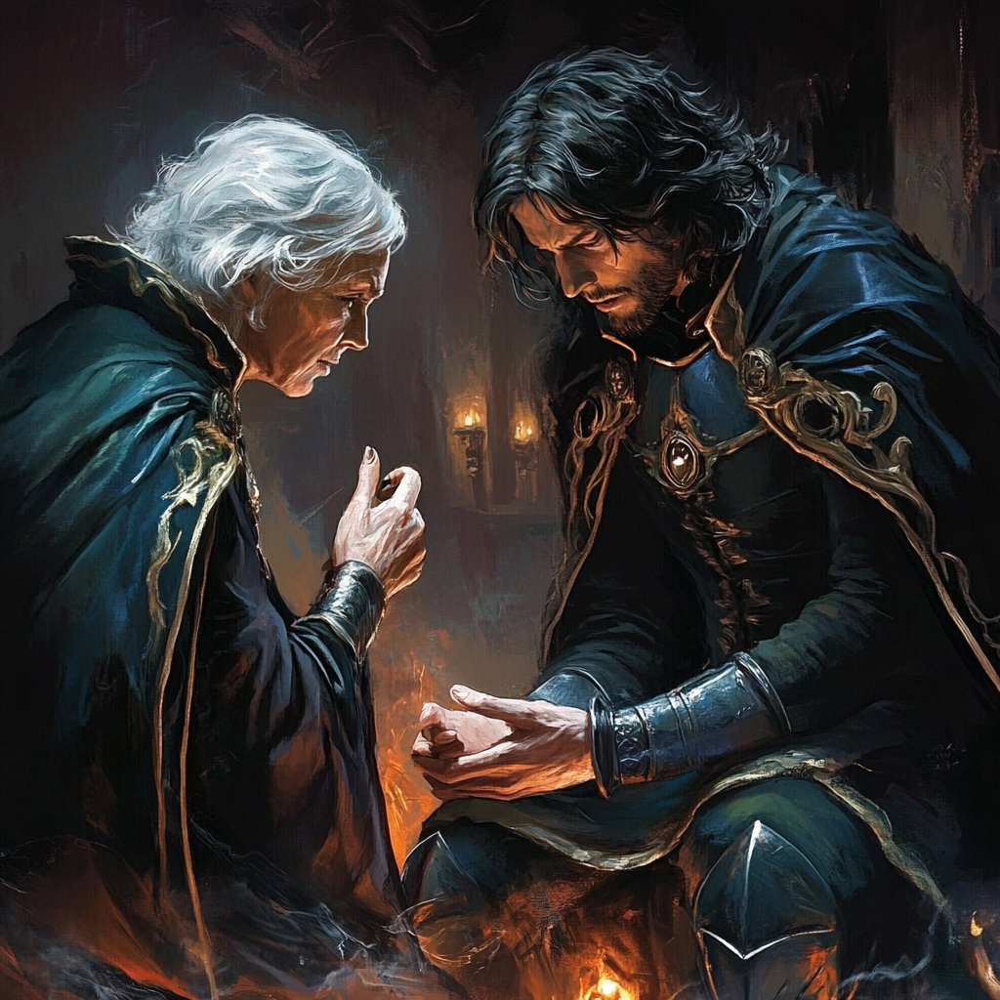

# Prologue

Mistvale is an isolated, fog-shrouded village haunted by tragedy, superstition, and secrets best left undisturbed. The campaign begins as the characters arrive, drawn by rumors of disappearances, hidden riches, or simply the need for shelter. The GM should set an oppressive, uncanny atmosphere: the fog is not natural, and the villagers seem as afraid of strangers as they are of whatever lurks in the darkness.

Mistvale is surrounded by dense woods and steep hills. The only road in is muddy and poorly maintained. The village itself consists of a handful of stone and timber buildings clustered around a central square, with a ruined abbey looming on a nearby hilltop. The fog is ever-present, muting sound and color, and making navigation difficult even for locals.

- The main themes are isolation, suspicion, and the thin barrier between the mundane and the supernatural.
- The campaign is designed for 3–5 characters of any background, though those with ties to the supernatural or the church may find themselves especially entangled.
- The story unfolds in seven chapters, each offering opportunities for investigation, combat, social intrigue, and moral choices.

::: squarebox
**Opening Narration**

*Fog shrouds the road, wrapping the trees and silence in a damp shroud. Hooves thud dully on wet earth. In the distance, a bell tolls, faint, signaling the end of the day. Mistvale appears before you like a shadow in the mist, its dark wooden houses and steep roofs huddled beneath the gray sky. A crow watches from a fence post, and as you cross the village threshold, the air itself seems to weigh on your shoulders. The inn, "The Smoking Lantern," offers the only warm light in the settlement. As you enter, the murmur dies and all eyes fix on you. The adventure begins, and the fog seems to close the exit behind you.*
:::

> **GM Note:**
> The introduction should be unsettling and evocative. Emphasize the villagers' discomfort and reluctance to talk. Treat the fog as a character: omnipresent and hostile.

---

# Chapter 1: Arrival in Mistvale

This chapter sets the tone and setting. The characters can explore the village, meet key NPCs, and begin to sense that nothing is as it seems. The GM should pace the information and let the players take the lead in investigation.

Mistvale is not a welcoming place. The villagers are wary of newcomers, and most keep their distance. The only exceptions are those with urgent needs or secrets to hide. The fog seems to follow the characters, thickening as they approach certain locations. The local children are especially superstitious, and many carry charms or talismans for protection.

## 1.1 The Fog Road

The journey to Mistvale should feel long and perilous. The fog makes navigation difficult and may cause the characters to doubt their senses. The crow that follows them may be an omen or a guide, as the GM chooses. If the players ignore it, simply add tension; if they follow, reward their curiosity with a minor clue.

- **Sights:** Trees looming out of the mist, distant church bells, flickers of movement in the fog.
- **Sounds:** Distant howls, the caw of the crow, the muffled thud of hooves or boots.
- **Feelings:** A sense of being watched, chills, confusion over direction.

The road is muddy and uneven, with deep ruts from carts that have long since broken down. Occasional stone markers, covered in moss and lichen, hint at the road's ancient origins. The fog grows thicker as the party nears the village, obscuring even the shapes of their own companions.

#### Random Encounters on the Road

Traveling the road to Mistvale is never uneventful, especially as the fog grows denser. Here are some possible encounters to use, each of which can set the tone for the supernatural and unsettling nature of the region:

- **A lost child, mute and shivering, who vanishes if followed.** The child leaves behind a small wooden toy, carved with strange runes.
- **A tangle of thorny vines that seem to move when not watched.** If touched, the thorns draw blood and the fog briefly becomes thicker.
- **A strange, old signpost pointing in impossible directions.** The names on the sign are in a language no one recognizes.
- **The sound of distant, echoing laughter that fades when approached.** The laughter sometimes turns into sobbing as the party draws near.
- **A broken cart with strange runes carved into the wood.** Searching the cart reveals a journal with cryptic warnings about the fog.

> **GM Note:**
> If the characters split up or get lost in the fog, use the fog effects table later on. Don't be afraid to unsettle the players with inexplicable events, but avoid unfair punishment at this early stage.

## 1.2 The Inn Encounter

The "Smoking Lantern" inn is the social heart of Mistvale. Here, the characters can interact with villagers, gather rumors, and begin to suspect that something is very wrong. The main NPCs have their own secrets and motivations, and may become allies or complications depending on player actions.

The inn is dimly lit, with a large hearth fire and a handful of battered tables. The air is thick with the smell of smoke, damp wool, and stew. Most villagers keep to themselves, speaking in low voices and glancing nervously at the newcomers. The innkeeper, Mirta, does her best to maintain a cheerful facade, but her eyes betray her worry.

The atmosphere is tense and conversations are brief and evasive. Villagers avoid speaking of the abbey or the disappearances, but a child approaches and hands the characters a cold iron amulet, saying he found it near the dry well. This object will be important later.

- **Rumors available at the inn:**
  - "The fog has never lifted since the fire at the abbey."
  - "People vanish on the new moon. Some say the woods take them."
  - "The priest is not what he seems."
  - "If you hear singing in the fog, run."
  - "The old well is cursed. Don't go near it after dark."

::: squarebox
**Inn Scene**

*The door creaks shut behind you. The warmth of the fire contrasts with the chill outside, but tension fills the air. Mirta greets you with a forced smile, while Jacob, seated in the corner, watches you openly. Father Silvan mutters a prayer, eyes lost in the candle flame. The murmur resumes, but conversations are barely whispers. A child approaches and offers you a cold iron amulet, saying he found it near the dry well. Night falls over Mistvale, and the fog thickens behind the steamed windows.*
:::

> **GM Note:**
> Let the players ask questions and seek alliances. NPCs can give hints, but never the whole truth. If the characters are hostile or too nosy, they may earn the villagers' distrust.

\fullpagestart

## 1.3 Key NPCs

The following NPCs are central to the story and can provide clues, aid, or complications. Each has a distinct personality and secret that can be revealed through investigation or social interaction.

| NPC Name           | Description                  | Motivation           | Secret                     |
|--------------------|-----------------------------|----------------------|----------------------------|
| Mirta              | Robust, kind innkeeper       | Protect her son      | Her son is missing         |
| Jacob the One-Eyed | Hard-eyed outsider           | Seeks his sister     | He suspects the priest     |
| Father Silvan      | Trembling priest             | Hides a secret       | He knows about the cult    |
| Marta the Maid     | Nervous, eavesdropper        | Wants to escape      | She saw the cult's ritual  |

\fullpageend

---

# Chapter 2: Secrets Beneath the Fog

This chapter focuses on investigation and exploration. The characters can visit different village locations, question villagers, and discover clues about the fog and the disappearances. Alternate tense moments with meaningful discoveries to keep the pace.

The village is divided into several key locations, each with its own secrets and dangers. The characters are free to choose where to go and whom to trust. Some villagers may offer help, while others will do anything to protect their own secrets.

## 2.1 Rumors and Clues

Rumors circulate, but it's hard to tell truth from superstition. Villagers speak of disappearances during the new moon, the burned abbey, and strange chants in the woods. Some believe the fog is a curse, others a divine punishment.

- **Disappearances:** Each new moon, someone vanishes without trace. None dare go out at night.
- **The Abbey:** After the fire, the abbey was left in ruins. None approach it now; it is said to be cursed.
- **The Woods:** At night, some have heard chanting or seen lights among the trees.
- **The Well:** Some say you can hear voices from its depths.
- **The Bell Tower:** The bell sometimes tolls by itself at midnight.

Let players choose which lead to follow first, encouraging free exploration.

#### Methods of Investigation

The characters have several ways to uncover the truth behind the fog and the disappearances. Each method can lead to different clues or encounters, and creative use of these approaches should be rewarded:

- **Questioning villagers:** Using charm, intimidation, or bribery can persuade villagers to share what they know. Some may reveal hidden fears, while others might attempt to mislead or warn the party away.
- **Exploring suspicious locations:** The well, the woods, and the abbey each hold secrets. Searching these places may reveal evidence of cult activity, supernatural phenomena, or lost villagers.
- **Following the crow or other omens:** The crow often appears before significant events. Tracking it might lead to hidden sites or warnings of danger.
- **Examining the amulet for magical properties:** Arcane knowledge or rituals can reveal the amulet's protective power against the fog and its denizens.
- **Watching the inn at night for suspicious activity:** Some cultists may meet after dark, or villagers may sneak out to perform strange rites.

Villagers are generally reluctant to speak, but may be convinced with kindness, gifts, or displays of strength. Some are genuinely frightened, while others are complicit in the cult's activities.

> **GM Note:**
> Each rumor should lead to a relevant location or NPC. If players show the amulet, some villagers react with fear, others with superstition. Use this to build tension and hint at its importance.

## 2.2 The First Sinister Encounter

The dry well is a key investigation point. Approaching it, the fog thickens and the temperature drops. Here, the first supernatural encounter occurs: a shadow emerges from the mist and attacks, proving the threat is real.

The well is surrounded by old, crumbling stones and overgrown weeds. The air is unnaturally cold, and the sound of dripping water echoes from the depths. Scratches and strange symbols are carved into the stones around the rim.

::: squarebox
**Well Encounter**

*As you investigate the dry well, the fog thickens and the cold intensifies. A shadow slides over the rim, barely visible except for two red eyes glowing in the gloom. A chill runs down your spines as the figure materializes, extending long, sharp claws. Silence reigns, broken only by your racing hearts. The shadow lunges, and the fog swirls around it like a cloak.*
:::

::: adversary
name: Mist Shadow
type: Tier 1 Minion
description: A specter shrouded in mist, barely visible but for its red eyes.
tactics: Ambush, flee if wounded
difficulty: 10
thresholds: 8 / 16
hp: 4
atk: +2
weapons:
  - Mist Claws: Close | 1d6+1 (Ethereal)
features:
  - Fade: Can pass through thin walls and vanish into the fog.
:::

This fight should be tense but not lethal. If the characters use the amulet, the shadow weakens or flees—an important clue.

## 2.3 Random Fog Effects Table

While exploring, the fog can cause strange events. Use this table to add tension, confusion, and a supernatural atmosphere.

| d8 | Fog Effect                                         |
|----|----------------------------------------------------|
| 1  | Voices whisper the characters' names.              |
| 2  | A metal object suddenly becomes ice-cold.          |
| 3  | A player sees a familiar figure in the mist.       |
| 4  | A known path seems to change direction.            |
| 5  | A dead animal appears on the path.                 |
| 6  | A character feels a cold hand on their shoulder.   |
| 7  | A chill runs through the group; all must test Will.|
| 8  | The fog briefly parts, revealing a monstrous shape.|

> **GM Note:**
> Use this table to break routine, build tension, or hint at the fog's magical nature.

---

# Chapter 3: The Cursed Abbey

The abbey is the heart of the mystery. Here the curse began, and here lies the key to breaking it. Exploring the abbey is dangerous, filled with traps, spectral presences, and forgotten secrets.

The abbey stands atop a low hill, its stone walls blackened by fire. The roof has collapsed in places, and the stained glass windows are shattered. Vines and moss creep over the stones, and the air is thick with the scent of damp earth and decay.

## 3.1 Exploring the Ruins

The abbey is divided into several zones: the crypt, the sacristy, the bell tower, and a hidden cellar. Each offers different challenges and rewards. Describe the decay, strange symbols on the walls, and the constant feeling of being watched.

| Location      | Risk         | Reward                |
|---------------|--------------|-----------------------|
| Crypt         | Ghosts       | Sacred relic          |
| Sacristy      | Trap         | Ancient scroll        |
| Bell Tower    | Vision       | View of the valley    |
| Hidden Cellar | Adversary    | Protective amulet     |

- **The crypt** is cold and silent, with ancient bones and flickering ghostly lights.
- **The sacristy** contains broken furniture and a hidden trapdoor.
- **The bell tower** provides a vantage point but is dangerous to climb.
- **The hidden cellar** is accessible only by solving a puzzle or finding a secret lever.

The abbey's walls are covered in faded murals depicting saints and monsters. Some of the symbols have been defaced or overwritten with strange runes. In the crypt, the air is so cold that breath steams even in summer.

::: squarebox
**Abbey Exploration**

*The ruins of the abbey rise like a stone skeleton in the mist. The altar is covered in strange symbols, and the air grows heavier with each step. Fresh footprints in the dust suggest you are not alone. A distant echo reverberates beneath the floor, and every corner seems to hide ancient secrets. The silence is so thick that any sound seems a shout. Touching the altar, you feel a strange vibration, as if something stirs beneath your feet.*
:::

> **GM Note:**
> If the characters explore thoroughly, they may find an old diary, a hidden passage, or even accidentally release a minor spirit.

#### Hazards in the Abbey

Exploring the abbey is fraught with danger. These hazards can be used to challenge the party or add suspense to their investigations:

- **Collapsing floors and ceilings:** Parts of the abbey are unstable, and a wrong step can lead to a sudden fall or being trapped beneath rubble.
- **Sudden drops in temperature:** Supernatural chills can sap the characters' strength and resolve, causing exhaustion or fear.
- **Apparitions that drain Will or cause fear:** Ghostly figures may appear, whispering secrets or threats, and can weaken the party's mental fortitude.
- **Traps left by the cult to deter intruders:** Hidden snares, poisoned needles, or magical wards may be found in key locations.
- **Cursed objects that tempt the greedy:** Relics left behind may offer power, but at a terrible price if taken.

## 3.2 Random Ruins Events Table

| d6 | Event in the Ruins                             |
|----|-----------------------------------------------|
| 1  | A ghost tries to possess a PC.                |
| 2  | The floor collapses, revealing a passage.     |
| 3  | A sacred object glows with blue light.        |
| 4  | A distant scream is heard.                    |
| 5  | A symbol burns on the wall and vanishes.      |
| 6  | A PC has a vision of the abbey's past.        |

> **GM Note:**
> Use these events to delay progress, provide clues, or increase the danger of exploration.

---

# Chapter 4: The Fog Cult

The characters discover that a secret cult is behind the events. This chapter may include chases, infiltration, and direct confrontations with cultists. Decide if the cult is large or just a handful of fanatics.

The cult is made up of villagers and outsiders who worship the Voice Beneath the Fog. They believe the fog is a blessing and perform rituals to maintain its power. The cult's leader is a charismatic but unstable figure who claims to have communed with the Voice.

The cultists are fanatical and will do anything to protect their secrets. They wear dark robes and masks, and their rituals involve chanting, sacrifices, and the use of cold iron to ward off spirits. The fog is both a tool and a shield for them.

| Cultist         | Distinctive Trait | Weapon          |
|-----------------|-------------------|-----------------|
| Hooded Leader   | Hypnotic voice    | Ritual dagger   |
| Young Acolyte   | Tattoos           | Wooden staff    |
| Blind Crone     | Smells of incense | Sharp nails     |
| Mute Twins      | Blank stare       | Ropes           |

## 4.1 Discovery

The cult performs rituals in the woods, using the fog as cover. The characters may find a circle of cultists mid-ritual, with a victim prepared for sacrifice. Interrupting the ritual may save a life, but also draw the cult's wrath.

The ritual site is marked by symbols in the earth and the stench of burning herbs. Cultists chant in a language none of the villagers speak. The victim may be a missing villager or an outsider.

- The cult uses the fog to hide their movements and confuse pursuers.
- If the ritual is interrupted, the cultists may fight, flee, or attempt to complete the ritual at any cost.
- Saving the victim may provide valuable information about the cult's plans.

::: squarebox
**Ritual in the Woods**

*In a forest clearing, the fog is so thick you can barely see a meter ahead. Voices chant in a forgotten tongue, and a hooded figure raises a knife above an improvised altar. Cultists sway around the circle, moving to the rhythm of guttural chants. The victim, bound and gagged, struggles to break free. The air vibrates with dark energy, and for a moment, you feel something ancient watching from the fog.*
:::

#### Cultist Tactics

The cultists are cunning and desperate, using every advantage the fog and their knowledge of the woods provide:

- **Use the fog to obscure movement and escape:** Cultists will dart in and out of the mist, making it hard to follow or target them.
- **Attempt to complete the ritual at any cost:** Their primary goal is to finish the sacrifice, even if it means sacrificing themselves.
- **Summon shadows or spirits to fight for them:** Some cultists have minor magical abilities and can call forth lesser spirits.
- **Target the most isolated or vulnerable character:** They will try to separate party members and pick them off one by one.
- **Bargain for their lives if cornered:** If defeat seems inevitable, a cultist may offer information or claim to be under duress.

## 4.2 Adversary: Cult Leader

::: adversary
name: Master of the Fog
type: Tier 2 Solo
description: A fanatical sorcerer, swathed in bandages and mist.
tactics: Control the fog, attack from afar
difficulty: 14
thresholds: 12 / 24
hp: 10
atk: +3
weapons:
  - Fog Ray: Ranged | 2d6 (Magical)
features:
  - Protective Mist: Ranged attacks against him have disadvantage.
  - Summon Specters: Can summon 1d4 Mist Shadows.
:::

The Master is a formidable foe and will use the fog to shield himself and escape if needed. If defeated, the cultists scatter, but the main threat remains.

> **GM Note:**
> The fight can be deadly if the players don't cooperate. If the victim is saved, they may become an ally or a source of information.

---

# Chapter 5: Revelations

This chapter ties all clues together and prepares for the climax. The characters may discover the full story of the curse and decide how to confront the Voice Beneath the Fog.

The diary, found in the abbey or with Father Silvan, reveals the curse's origin: an ancient ritual to seal the Voice Beneath the Fog, requiring the sacrifice of an innocent. The diary also mentions the cold iron amulet and a hidden passage under the bell tower.

## 5.1 The Lost Diary

The diary is written in a shaky hand, with pages torn and stained. It describes the events leading up to the abbey fire, the failed ritual, and the growing power of the fog. The final entries are desperate pleas for forgiveness and warnings to future generations.

::: squarebox
**Diary Reading**

*"Today we sealed the crypt. But the fog does not lift. Something watches us from the other side... Father Silvan says we must pray, but I know only the sacrifice of an innocent can maintain the seal. I hid the amulet in the bell tower, hoping none would find it. If you read this, beware: the Voice Beneath the Fog does not forget, and the fog is its breath."*
:::

- The cold iron amulet repels shadows.
- The cult seeks to release "the Voice Beneath the Fog."
- The altar must be purified with innocent blood.
- There is a hidden passage under the bell tower.

#### Clues from the Diary

The diary provides several vital insights, each of which can drive the party’s next decisions:

- **The original ritual was incomplete:** The seal on the crypt is weak, and the Voice is growing stronger.
- **The abbey fire was not an accident:** The cult set the fire to cover up their failed ritual.
- **The priest may know more than he admits:** Father Silvan’s guilt and fear are clues to his involvement.
- **The amulet's power is strongest at midnight:** Timing may be crucial for the final confrontation.

> **GM Note:**
> The diary can be found in the sacristy or with Father Silvan. It connects clues and motivates the final confrontation.

## 5.2 Random Night Encounters Table

| d6 | Night Encounter in Mistvale                      |
|----|--------------------------------------------------|
| 1  | A villager knocks, begging for help.             |
| 2  | Strange noises on the roof.                      |
| 3  | A specter passes through the wall, whispering secrets.|
| 4  | An animal enters the room and dies instantly.    |
| 5  | A shadow tries to steal a magical item.          |
| 6  | A character dreams of the Voice Beneath the Fog. |

> **GM Note:**
> Use these encounters to keep up tension and danger, even during rest.

---

# Chapter 6: The Final Ritual

This is the campaign's climax. The characters must decide how to face the Voice Beneath the Fog: purify the altar, destroy it, use the amulet, or find another solution. Their choices will have consequences for the village and themselves.

The crypt is deep beneath the abbey, accessible only through a hidden passage. The air is thick with the stench of mold and rot. The altar is covered in dried blood and strange runes that pulse with a sickly light.

## 6.1 Preparations

Players can seek allies, set traps, or investigate the altar before the final confrontation. Using the amulet or performing a sacrifice may weaken or seal the Voice for good, but at a high price.

#### Possible Preparations

Before facing the final threat, the party can:

- **Enlist the help of surviving villagers or the rescued cult victim:** Allies can provide support, healing, or even magical aid.
- **Set up magical wards or traps in the crypt:** These can hinder the Voice or its minions, giving the heroes an edge.
- **Research the original ritual for clues:** Old texts or the diary may reveal a weakness or required component for victory.
- **Create distractions to split the cult's forces:** Drawing cultists away from the crypt can make the final battle easier.
- **Decide who will wield the amulet or make the ultimate sacrifice:** The amulet’s power is great, but it may come at a terrible cost to its bearer.

::: squarebox
**Crypt Climax**

*The crypt opens before you like a wound in the earth. The walls ooze dampness and the air is unbreathable. In the center, the altar glows with unnatural light, and the fog coils in impossible spirals. Voices whisper in your ears, promising power, vengeance, or redemption. The Voice Beneath the Fog materializes, a shapeless shadow with countless eyes and mouths that never stop murmuring. The final battle is about to begin, and only one side will prevail.*
:::

## 6.2 Final Adversary

::: adversary
name: The Voice Beneath the Fog
type: Tier 3 Solo
description: An ancient entity, made of shadows and whispers.
tactics: Manipulate minds, absorb light
difficulty: 18
thresholds: 20 / 40
hp: 16
atk: +5
weapons:
  - Touch of Despair: Close | 3d6+2 (Magical)
  - Silent Scream: Area | 2d8 (Psychic)
experience: Forbidden Wisdom +5
features:
  - Immune to non-magical weapons.
  - Each time it deals damage, it heals 2 HP.
  - Can possess a character for 1 turn (hard save).
:::

The fight should be epic and terrifying. If the characters fail, the Voice may escape and spread the fog elsewhere. If they succeed, they may free the village, but not without paying a price.

> **GM Note:**
> Adjust the difficulty based on the group's resources and choices. Reward cleverness with advantages in the final fight.

---

# Chapter 7: The Echo of the Fog

This chapter serves as the denouement and shows the consequences of the characters' actions. The village may be saved, cursed, or left with strange aftereffects. Use this chapter to open new plots or close the story.

After the final confrontation, Mistvale may be freed from the fog or forever marked. The villagers react according to the outcome, and new mysteries may arise.

**Possible endings:**

- The fog lifts, and Mistvale begins to heal.
- The fog remains, but the cult is gone—at least for now.
- The Voice is banished, but at the cost of a character's life or soul.
- The curse is broken, but a new threat emerges from the darkness.

::: squarebox
**Epilogue Narration**

*The fog begins to lift, revealing the first rays of sun over Mistvale. Villagers emerge from their homes, stunned, and look at you with both respect and fear. The crow takes flight, vanishing into the horizon. You know you have changed the village's fate, but also that darkness always lurks in the world's forgotten corners. As you leave, a last glance back reveals that the fog never truly disappears.*
:::

## 7.2 Random Aftermath Table

| d4 | Aftermath of the Adventure                      |
|----|------------------------------------------------|
| 1  | A villager develops strange powers.            |
| 2  | One of the heroes' items starts whispering at night.|
| 3  | Mistvale's weather becomes unpredictable.      |
| 4  | A child claims to speak with the fog.          |

> **GM Note:**
> Use these aftermaths to connect with future adventures or leave a sense of unease.

---

# Appendices

## A. Magical Items

| Item                 | Effect                                      |
|----------------------|---------------------------------------------|
| Cold Iron Amulet     | Grants advantage vs. specters and fog       |
| Scroll of Light      | Disperses fog in a small area for 1 hour    |
| Abbey Dagger         | Ignores immunities of ethereal creatures    |
| Bell of Warding      | Rings to repel spirits for one hour         |
| Lantern of True Sight| Reveals hidden things in the fog            |

## B. Adventure Hooks

- An echo of the fog appears in another village.
- A missing villager returns... changed.
- The diary mentions another crypt in the north.
- The church sends investigators to Mistvale.
- The crow returns, bearing a mysterious message.

> **GM Note:**
> Use these hooks to expand the campaign or link to future adventures.

## C. Sample Lists for GM Use

#### Suspicious Behaviors in Villagers

Villagers in Mistvale often act in ways that betray their fear or complicity. Observant characters may notice:

- **Avoiding eye contact when asked about the abbey:** Villagers quickly change the subject or walk away.
- **Whispering and glancing at the party when they pass:** Groups of villagers hush as the party approaches.
- **Locking doors and windows at sunset:** The village becomes eerily quiet as night falls.
- **Leaving offerings at the edge of the woods:** Small bundles of herbs, bread, or coins are left as appeasement.
- **Refusing to speak the name of the cult leader:** Even when pressed, villagers only refer to "the one in the mist."

#### Ways to Earn the Villagers' Trust

Winning the trust of Mistvale’s people can open doors and reveal secrets. The party can:

1. **Help find a missing child or pet:** Acts of kindness are remembered and rewarded.
2. **Heal a sick villager or livestock:** Practical aid earns gratitude.
3. **Stand up to a bully or cultist in public:** Bravery inspires others to speak out.
4. **Share food or resources with the needy:** Generosity is rare and valued.
5. **Show respect for local traditions and taboos:** Observing rituals and avoiding forbidden places builds rapport.

\fullpagestart

## D. Visual Material

| Chapter   | Location            | Weather    | Dangers           | Potential Allies   |
|-----------|---------------------|------------|-------------------|--------------------|
| 1         | Road to Mistvale    | Fog        | Wolves, bandits   | Guiding crow       |
| 2         | Inn and well        | Rain       | Shadow, cultist   | Mirta              |
| 3         | Abbey               | Wind       | Ghosts            | Father Silvan      |
| 4         | Woods               | Dense fog  | Cult, traps       | Amulet child       |
| 5         | Crypt               | Silence    | Ancient Voice     | None               |
| 6         | Mistvale            | Weak sun   | Magical aftermath | Villagers          |

## E. Loot and Rewards

| \\#  | Loot or Reward                       | Type           | Description                                                                                     | Special Effect / Use                                   |
|----|--------------------------------------|----------------|-------------------------------------------------------------------------------------------------|--------------------------------------------------------|
| 1  | Small Coin Pouch                     | Mundane        | Contains 23 assorted copper and silver coins.                                                   | -                                                      |
| 2  | Silver Signet Ring                   | Jewelry        | A ring bearing the crest of a forgotten noble house.                                            | May be recognized by local historians.                 |
| 3  | Potion of Minor Healing              | Consumable     | Restores 1d6+2 HP when drunk.                                                                   | -                                                      |
| 4  | Ornate Dagger                        | Weapon         | A beautifully crafted dagger with an ivory handle.                                              | Counts as a status symbol in some courts.              |
| 5  | Bag of Marbles                       | Toy/Tool       | A leather pouch filled with colorful glass marbles.                                             | Can be scattered to trip pursuers (DC 12 save).        |
| 6  | Scroll of Detect Magic               | Scroll         | One-use scroll that reveals magical auras within 30 feet.                                       | -                                                      |
| 7  | Amulet of the Mist                   | Magic Item     | Grants advantage on Stealth checks in fog or mist.                                              | Glows faintly in moonlight.                            |
| 8  | Traveler’s Journal                   | Book           | A diary with notes about local legends and hidden places.                                       | Contains a clue to a nearby secret.                    |
| 9  | Fine Silk Handkerchief               | Mundane        | Embroidered with golden thread and initials “A.F.”                                              | Can be sold to a collector or used as a gift.          |
| 10 | Bag of Strange Seeds                 | Curiosity      | Seeds from an unknown plant, slightly warm to the touch.                                        | If planted, may grow into something magical.           |
| 11 | Gold-plated Comb                     | Jewelry        | Decorated with tiny gemstones.                                                                  | -                                                      |
| 12 | Potion of Spider Climb               | Consumable     | Grants the ability to walk on walls and ceilings for 10 minutes.                                | -                                                      |
| 13 | Rusty Old Key                        | Tool           | An ancient iron key, covered in rust.                                                           | Opens a hidden door in the abbey crypt.                |
| 14 | Map Fragment                         | Map            | Torn piece of a map showing part of the nearby forest.                                          | Can be combined with other fragments.                  |
| 15 | Silvered Arrow (3)                   | Ammunition     | Three arrows with silver tips, effective against undead.                                        | +1 damage to undead or lycanthropes.                   |
| 16 | Locket with Miniature                | Jewelry        | Contains a tiny, detailed painting of a young woman.                                            | May be recognized by a local NPC.                      |
| 17 | Enchanted Candle                     | Magic Item     | Burns with a blue flame, never goes out unless willed.                                          | Reveals invisible creatures within 10 feet.            |
| 18 | Bundle of Rare Herbs                 | Trade Good     | Used in high-quality potions or as incense.                                                     | Sought by alchemists and herbalists.                   |
| 19 | Ornate Lockbox (locked)              | Container      | Small, sturdy box with intricate carvings (lock DC 15).                                         | Contains a random minor treasure.                      |
| 20 | Cloak of the Common Folk             | Magic Item     | Grants advantage on Deception checks to blend in with crowds.                                   | Looks plain but is always clean.                       |
| 21 | Bag of Holding (Tiny)                | Magic Item     | Can store up to 50 lbs. of items, but only small objects fit.                                   | -                                                      |

\fullpageend
